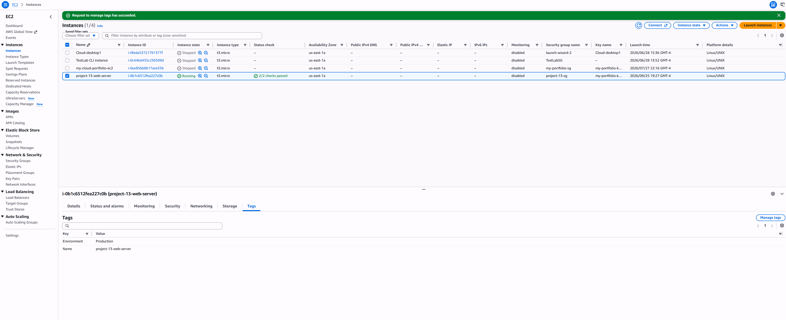
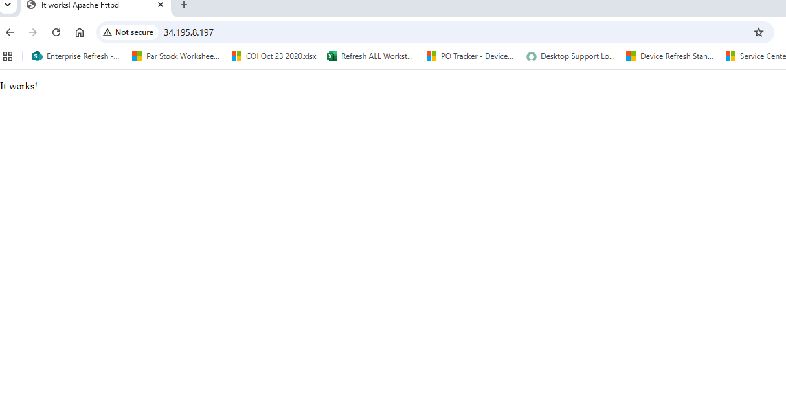
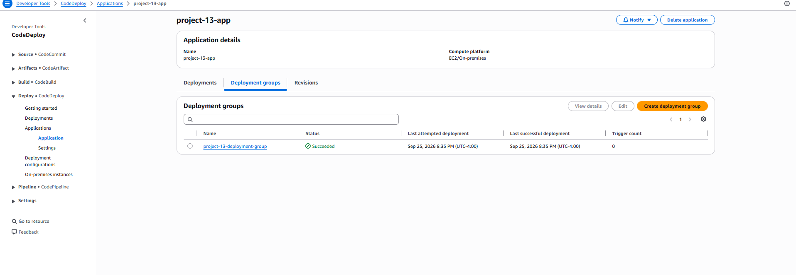
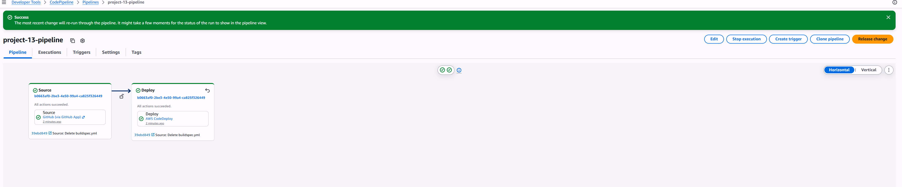
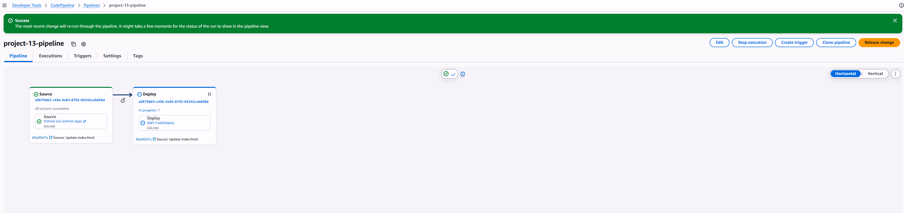
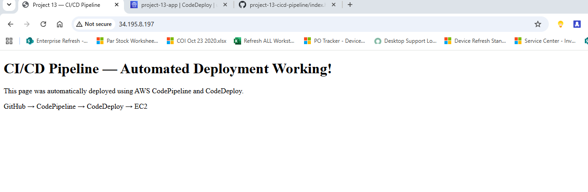
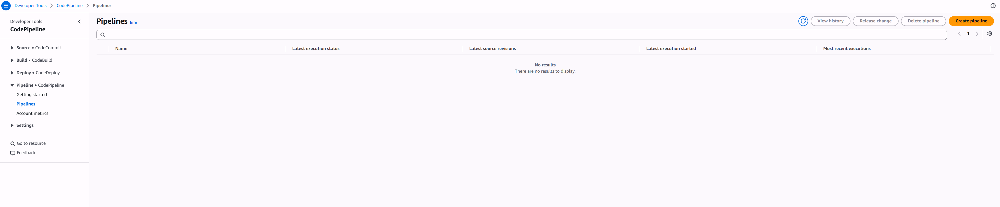

# Project 13 — CI/CD Pipeline with CodePipeline and CodeDeploy

## Overview
Built a fully automated CI/CD pipeline that deploys a web application to EC2 every time code is pushed to GitHub — with zero manual steps. Every commit to the main branch automatically triggers CodePipeline, which passes the source files directly to CodeDeploy for deployment to an EC2 instance running Apache. Both stages completed successfully and the updated page was live on EC2 confirming the pipeline works end to end.

## AWS Services Used
- **AWS CodePipeline** — orchestrates the two-stage pipeline, watches GitHub for changes, and triggers deployment automatically on every push to main
- **AWS CodeDeploy** — deploys source files to EC2 using appspec.yml, handles file copy and server restart lifecycle hooks
- **Amazon EC2** — hosts the Apache web server that serves the deployed application
- **Amazon S3** — stores pipeline artifacts between stages (auto-created by CodePipeline)
- **AWS IAM** — service roles granting CodeDeploy and EC2 the permissions they need

## Architecture

GitHub repo (push to main)
↓ triggers automatically
CodePipeline — project-13-pipeline
├── Stage 1: Source ← pulls latest code from GitHub
└── Stage 2: Deploy ← CodeDeploy installs on EC2 using appspec.yml
↓
EC2 — project-13-web-server (Apache)
↓
http://[ec2-public-ip] (live deployed site)

## What I Built

### GitHub Repository Files
- **index.html** — the web application deployed to EC2
- **appspec.yml** — CodeDeploy instructions defining file copy destination and lifecycle hooks
- **scripts/restart_server.sh** — post-install script that restarts Apache after deployment

### IAM Roles
- **CodeDeployServiceRole** — allows CodeDeploy to interact with EC2 instances
- **EC2CodeDeployRole** — instance profile allowing EC2 to communicate with CodeDeploy and read S3 artifacts

### EC2 Instance
- Amazon Linux 2023 — t2.micro
- Apache (httpd) installed and enabled via User Data script
- CodeDeploy agent installed and running via User Data script
- Tagged Environment:Production for CodeDeploy targeting

### CodeDeploy
- Application: project-13-app (EC2/On-premises compute platform)
- Deployment group targeting EC2 instances with tag Environment:Production
- In-place deployment strategy with CodeDeployDefault.OneAtATime

### CodePipeline
- Two-stage pipeline: Source (GitHub) → Deploy (CodeDeploy)
- GitHub App connection for secure webhook-based triggering
- Automatic execution on every push to main branch
- No build stage needed — source files deploy directly, which is the correct pattern for static web applications

### Automated Deployment Proof
Pushed a live code change to GitHub and triggered the pipeline — both stages completed successfully and the updated page was live on EC2 with no manual intervention confirming the pipeline works end to end.

## Key Learnings
- How appspec.yml defines CodeDeploy file mappings and lifecycle event hooks
- How IAM roles enable secure service-to-service communication in AWS
- How CodePipeline orchestrates multi-stage pipelines triggered by source changes
- How deployment groups use EC2 tags to target specific instances
- Why the CodeDeploy agent must be running on EC2 for deployments to succeed
- When a build stage is and is not needed in a CI/CD pipeline

## Production Improvements
- Add a CodeBuild stage for applications that require compilation or testing
- Implement blue/green deployment strategy for zero-downtime deployments
- Add SNS notifications for pipeline success and failure events
- Use Parameter Store for environment-specific configuration
- Add manual approval stage before production deployments

## Cost
Approximately $0.02 to $0.05 for a 1-2 hour session. All resources deleted immediately after project completion.

## Screenshots

---
*Part of my AWS Cloud Engineering Portfolio | [View all projects](https://github.com/dcprice79)*
